# Домашнее задание к занятию 4 «Оркестрация группой Docker контейнеров на примере Docker Compose»

## Задание 1 
https://hub.docker.com/repository/docker/android83/custom-nginx/general

## Задание 2

### 1. Запустите ваш образ custom-nginx:1.0.0 командой docker run в соответвии с требованиями:
    имя контейнера "ФИО-custom-nginx-t2"
    контейнер работает в фоне
    контейнер опубликован на порту хост системы 127.0.0.1:8080
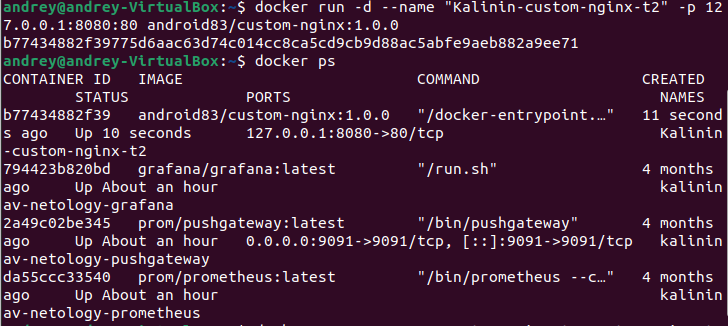

### 2. Не удаляя, переименуйте контейнер в "custom-nginx-t2"
### 3. Выполните команду date +"%d-%m-%Y %T.%N %Z" ; sleep 0.150 ; docker ps ; ss -tlpn | grep 127.0.0.1:8080  ; docker logs custom-nginx-t2 -n1 ; docker exec -it custom-nginx-t2 base64 /usr/share/nginx/html/index.html
### 4. Убедитесь с помощью curl или веб браузера, что индекс-страница доступна.
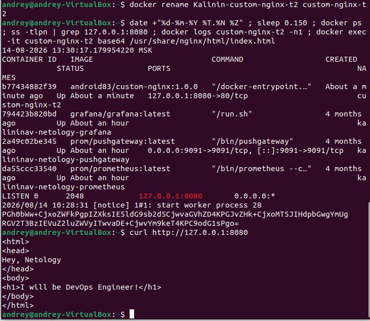
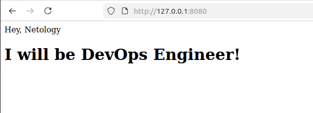

## Задание 3

### 1. Воспользуйтесь docker help или google, чтобы узнать как подключиться к стандартному потоку ввода/вывода/ошибок контейнера "custom-nginx-t2".
### 2. Подключитесь к контейнеру и нажмите комбинацию Ctrl-C.
### 3. Выполните docker ps -a и объясните своими словами почему контейнер остановился.
Контейнер остановился, потому что главный процесс (nginx) получил сигнал остановки (Ctrl+C) и завершил свою работу. 
Без работающих процессов контейнер не может существовать — он автоматически переходит в статус Exited. (завершение работы)
### 4. Перезапустите контейнер
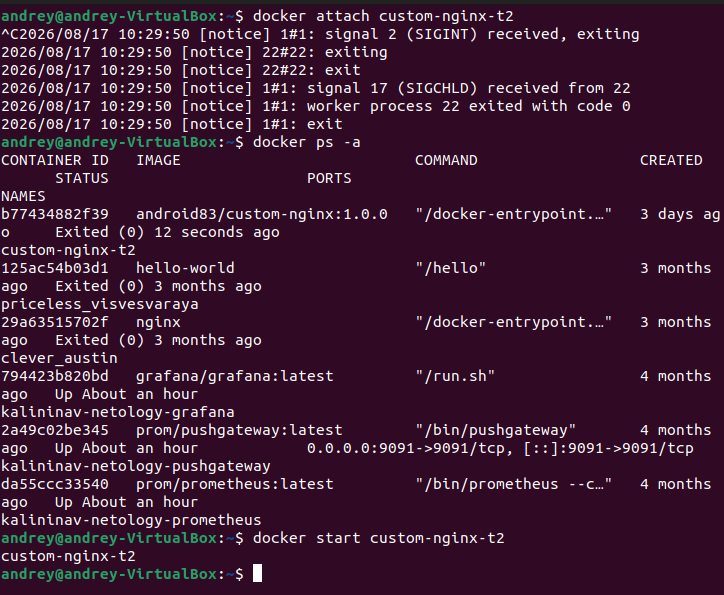
### 5. Зайдите в интерактивный терминал контейнера "custom-nginx-t2" с оболочкой bash.
### 6. Установите любимый текстовый редактор(vim, nano итд) с помощью apt-get.
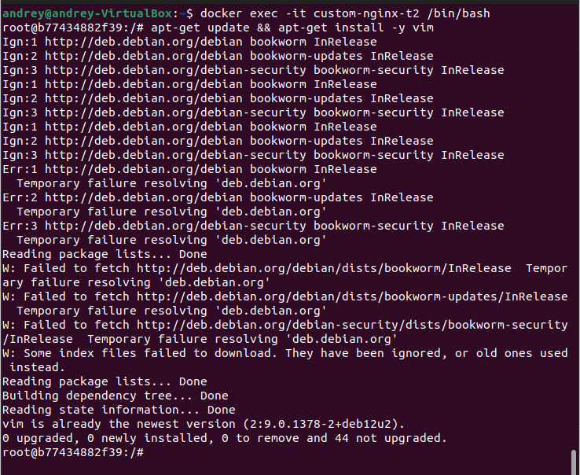
### 7. Отредактируйте файл "/etc/nginx/conf.d/default.conf", заменив порт "listen 80" на "listen 81".
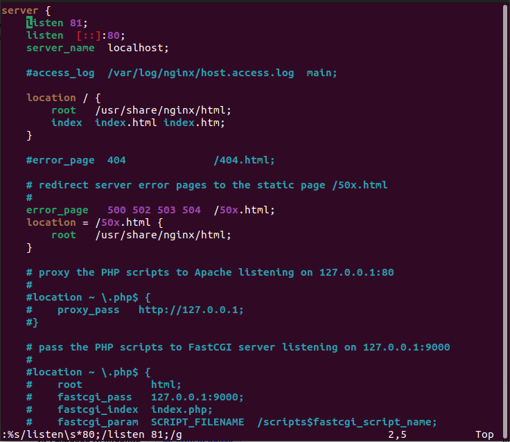
### 8. Запомните(!) и выполните команду nginx -s reload, а затем внутри контейнера curl http://127.0.0.1:80 ; curl http://127.0.0.1:81.
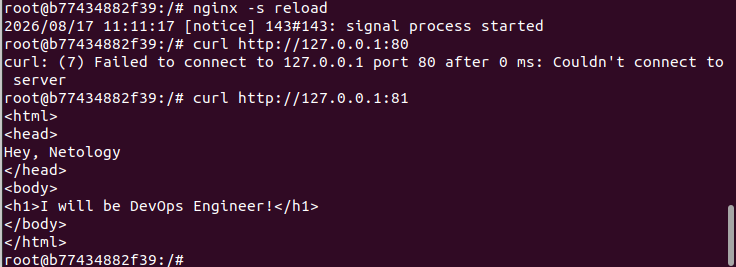
### 9. Выйдите из контейнера, набрав в консоли exit или Ctrl-D.
### 10. Проверьте вывод команд: ss -tlpn | grep 127.0.0.1:8080 , docker port custom-nginx-t2, curl http://127.0.0.1:8080. Кратко объясните суть возникшей проблемы.
При изменении порта, который слушает приложение внутри контейнера, необходимо также обновить проброс портов (порт-маппинг) при запуске контейнера, 
иначе трафик с хоста не будет попадать на правильный порт внутри контейнера.
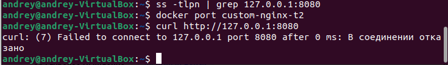
### 12. Удалите запущенный контейнер "custom-nginx-t2", не останавливая его.(воспользуйтесь --help или google)
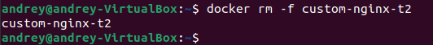

## Задание 4
### 1. Запустите первый контейнер из образа centos c любым тегом в фоновом режиме, подключив папку текущий рабочий каталог $(pwd) на хостовой машине в /data контейнера, используя ключ -v.
### 2.Запустите второй контейнер из образа debian в фоновом режиме, подключив текущий рабочий каталог $(pwd) в /data контейнера.
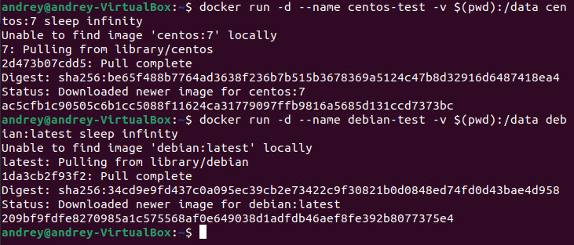
### 3.Подключитесь к первому контейнеру с помощью docker exec и создайте текстовый файл любого содержания в /data.
### 4.Добавьте ещё один файл в текущий каталог $(pwd) на хостовой машине.
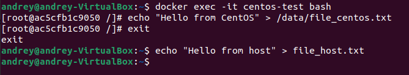
### 5.Подключитесь во второй контейнер и отобразите листинг и содержание файлов в /data контейнера.
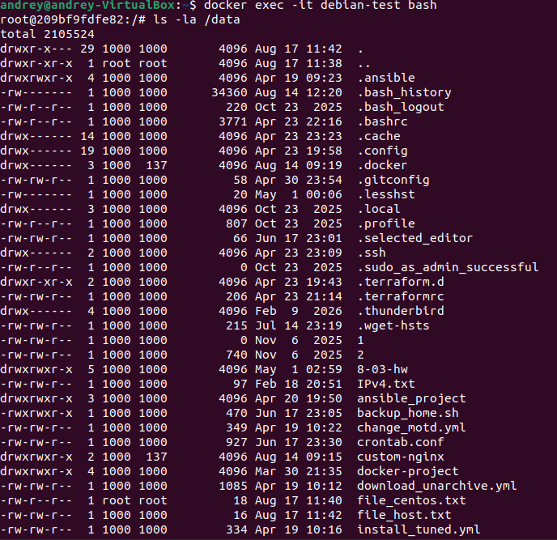
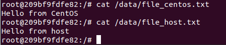

## Задание 5

### 1. Создайте отдельную директорию(например /tmp/netology/docker/task5) и 2 файла внутри него. "compose.yaml" с содержимым:
version: "3"
services:
  portainer:
    network_mode: host
    image: portainer/portainer-ce:latest
    volumes:
      - /var/run/docker.sock:/var/run/docker.sock
"docker-compose.yaml" с содержимым:

version: "3"
services:
  registry:
    image: registry:2

    ports:
    - "5000:5000"
И выполните команду "docker compose up -d". Какой из файлов был запущен и почему? (подсказка: https://docs.docker.com/compose/compose-application-model/#the-compose-file )

### 2. Отредактируйте файл compose.yaml так, чтобы были запущенны оба файла. (подсказка: https://docs.docker.com/compose/compose-file/14-include/)

### 3. Выполните в консоли вашей хостовой ОС необходимые команды чтобы залить образ custom-nginx как custom-nginx:latest в запущенное вами, локальное registry. Дополнительная документация: https://distribution.github.io/distribution/about/deploying/

### 4. Откройте страницу "https://127.0.0.1:9000" и произведите начальную настройку portainer.(логин и пароль адмнистратора)

### 5. Откройте страницу "http://127.0.0.1:9000/#!/home", выберите ваше local окружение. Перейдите на вкладку "stacks" и в "web editor" задеплойте следующий компоуз:

version: '3'

services:
  nginx:
    image: 127.0.0.1:5000/custom-nginx
    ports:
      - "9090:80"
### 6. Перейдите на страницу "http://127.0.0.1:9000/#!/2/docker/containers", выберите контейнер с nginx и нажмите на кнопку "inspect". В представлении <> Tree разверните поле "Config" и сделайте скриншот от поля "AppArmorProfile" до "Driver".

### 7. Удалите любой из манифестов компоуза(например compose.yaml). Выполните команду "docker compose up -d". Прочитайте warning, объясните суть предупреждения и выполните предложенное действие. Погасите compose-проект ОДНОЙ(обязательно!!) командой.

Docker Compose использует только один основной файл (с наивысшим приоритетом). Остальные файлы с другими именами игнорируются, 
если не указаны явно через -f. Поэтому при наличии compose.yaml сервис из docker-compose.yaml не запускается.

